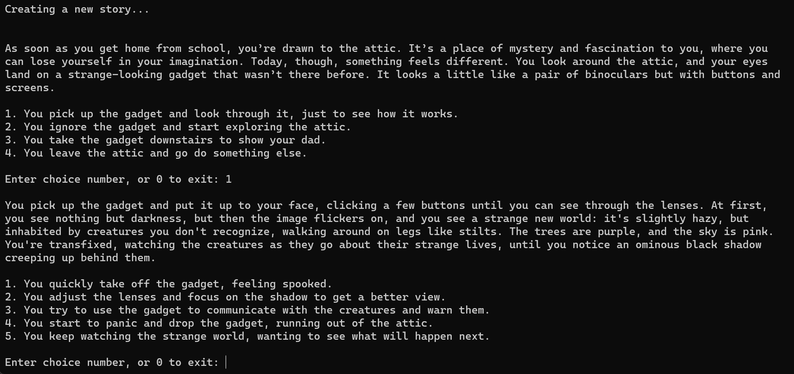
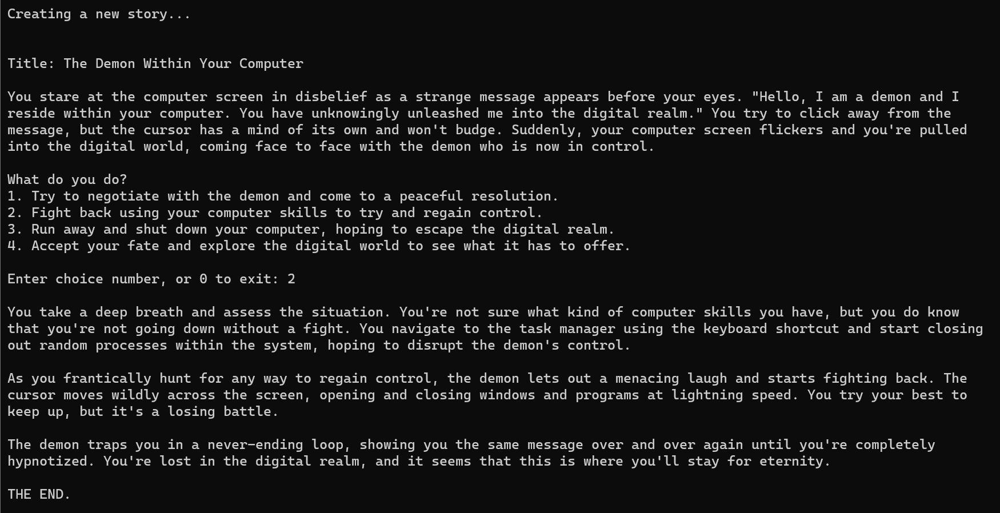

# choose_your_own_adventure
Use a language model to create choose-your-own-adventure style stories

## Features

If you are old enough to remember choose-your-own-adventure books, you will know exactly what this is. Using an AI language model, a new and original story will be generated each time. You will be shown one page of the story at a time, and then be given several options for what you want to do next. 

python main.py view another world


Based on your choices, you may have an exciting adventure that leads to a happy and prosperous ending. Choose poorly, and you could meet an unpleasant end.

python main.py demon in computer


I created this project to demonstrate building a simple but practical application with currently available language models. And also because I loved choose-your-own-adventure books as a kid.

## Clone the repository

```console
git clone https://github.com/dmisino/choose_your_own_adventure.git
cd choose_your_own_adventure
```

## Installation and setup

To run this project, you'll need Python installed on your machine. You can install it from [python.org](https://www.python.org/downloads/).

## OpenAI API

This project uses the [OpenAI API](https://platform.openai.com/). You will need to get an API key, and to add that to a .env file you create within the project directory. This project includes a .env-sample file, which you can rename to .env, and then add your API key there. 

Alternately you can set the API key in your environment:

```console
rem Windows
set OPENAI_API_KEY=<your api key>

rem Unix or Mac
export OPENAI_API_KEY=<your api key>
```

This project uses the [Chat Completions API](https://platform.openai.com/docs/guides/chat), with the gpt-3.5-turbo model. At [current prices](https://openai.com/pricing), running a story through about 10 to 12 choices to completion may use around 8000 tokens, at a cost of about $0.02 USD (2 cents). 

## Usage
 
 ```console
python main.py
 ```

## Command line options

You can seed a topic or idea for the story to be generated by adding some text to the command line. Examples:

```console
python main.py journey through a black hole
python main.py demon in computer
python main.py space whales
python main.py sentient gummy bears
python main.py cthulu is actually a nice guy
python main.py robot ladybugs seek revenge
```

You get the idea. Have fun!